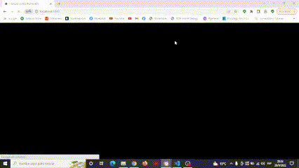

# React - Proyecto final
## Tienda online - Eyestronomy

#### *Proyecto realizado durante el curso de ReactJs en Coderhouse, con base de datos en Google Firebase. Tienda en linea de compra de productos, con carga en carrito, y generacion de orden de compra.*

>Implementacion 

### Herramientas implementadas en este proyecto

* ReactJS
* Css
* Javascript
* React-Bootstrap
* sweet alert

#### *Tienda con carrito de compras, para agregar y eliminar productos, con conteo de stock, posibilidad de finalizar compra y cargar datos de usuario, los mismos se guardan en firebase, todo funcionando de manera dinamica. Suma parcial y del total de las compras, ademas, filtro entre diferentes categorias de productos (los mismos se consultan en base de datos de firebase)*

